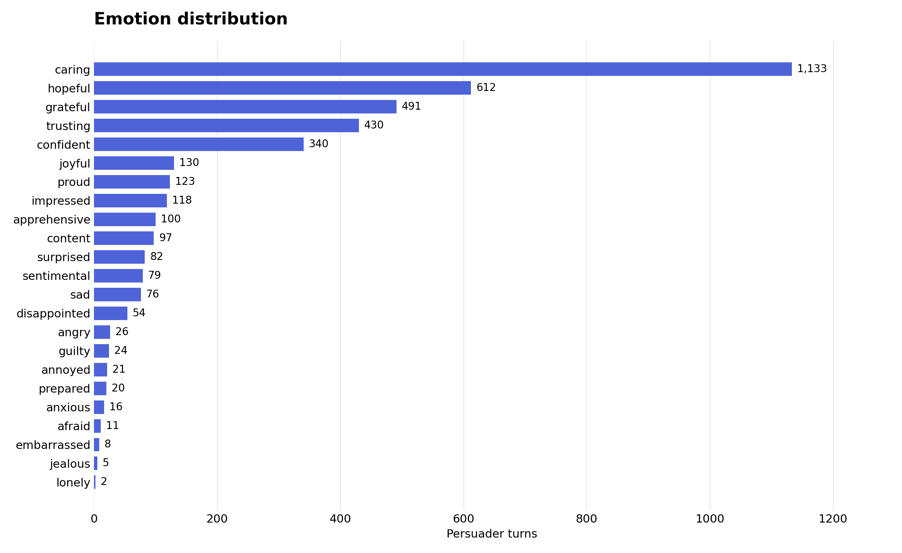
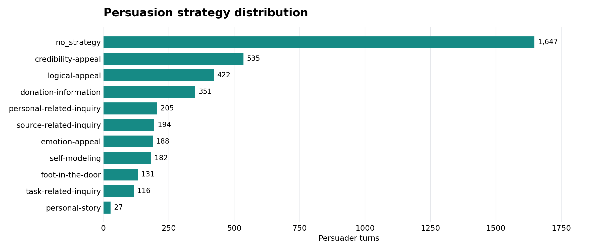

# RL-Emo-Per dataset

English conversations about donating to Save the Children. The release contains
385 dialogues, 7,906 speaker turns, 3,998 persuader targets, and 3,908 persuadee
context turns. Persuader targets have one of 23 emotion labels and one of 11
persuasion strategy labels. The emotion counts match the distribution shown in
[the paper](https://aclanthology.org/2022.findings-naacl.63/).

The 1,017-dialogue PersuasionForGood corpus is the parent corpus; the files here
contain the 385-dialogue emotion dataset used by RL-Emo-Per.

## Files

| File | Contents |
| --- | --- |
| `dialogues.csv` | All 7,906 turns, including split membership |
| `train.csv` | Training dialogues |
| `validation.csv` | Validation dialogues |
| `emotion_counts.csv` | Emotion IDs, counts, percentages, and split counts |
| `strategy_counts.csv` | Strategy IDs, counts, percentages, and split counts |
| `labels.json` | Ordered label vocabularies; list position is the class ID |
| `paper_emotion_counts.json` | Emotion counts corresponding to the paper |
| `manifest.json` | Dataset schema, split configuration, statistics, and SHA-256 checksums |

## Columns

| Column | Meaning |
| --- | --- |
| `dialogue_id` | Original conversation ID |
| `turn_id` | Zero-based round index, shared by the two speakers |
| `speaker` | `persuader` or `persuadee` |
| `text` | Speaker utterance, preserving its text and whitespace |
| `emotion` / `emotion_id` | Emotion name and zero-based class ID |
| `strategy` / `strategy_id` | Strategy name and zero-based class ID |
| `split` | `train` or `validation` |

A unique turn is identified by `(dialogue_id, turn_id, speaker)`. The persuader
speaks before the persuadee in each round. CSV fields can contain commas,
quotes, and newlines; use a CSV reader. Emotion and strategy fields are empty
for persuadee context turns. `no_strategy` is a valid persuader target class.

## Splits

| Split | Dialogues | All turns | Persuader targets | Persuadee context |
| --- | ---: | ---: | ---: | ---: |
| train | 346 | 7,108 | 3,596 | 3,512 |
| validation | 39 | 798 | 402 | 396 |

Dialogue IDs are sorted and shuffled with seed 42, then divided into 346 training
and 39 validation dialogues. The smallest number of dialogue swaps ensures every
emotion and strategy class occurs in training. All turns in a dialogue stay in
the same split. These split files define the release partition.

## Label distributions

Counts and percentages below refer to the 3,998 persuader targets. The numeric
IDs are stable and match `labels.json`.

### Emotions

| ID | Emotion | Count | Percent | Train | Validation |
| ---: | --- | ---: | ---: | ---: | ---: |
| 0 | sentimental | 79 | 1.98% | 70 | 9 |
| 1 | afraid | 11 | 0.28% | 11 | 0 |
| 2 | proud | 123 | 3.08% | 111 | 12 |
| 3 | trusting | 430 | 10.76% | 385 | 45 |
| 4 | joyful | 130 | 3.25% | 117 | 13 |
| 5 | angry | 26 | 0.65% | 22 | 4 |
| 6 | sad | 76 | 1.90% | 71 | 5 |
| 7 | jealous | 5 | 0.13% | 5 | 0 |
| 8 | grateful | 491 | 12.28% | 443 | 48 |
| 9 | prepared | 20 | 0.50% | 19 | 1 |
| 10 | embarrassed | 8 | 0.20% | 7 | 1 |
| 11 | surprised | 82 | 2.05% | 74 | 8 |
| 12 | annoyed | 21 | 0.53% | 21 | 0 |
| 13 | lonely | 2 | 0.05% | 2 | 0 |
| 14 | guilty | 24 | 0.60% | 21 | 3 |
| 15 | confident | 340 | 8.50% | 308 | 32 |
| 16 | disappointed | 54 | 1.35% | 52 | 2 |
| 17 | caring | 1,133 | 28.34% | 1,020 | 113 |
| 18 | apprehensive | 100 | 2.50% | 93 | 7 |
| 19 | anxious | 16 | 0.40% | 15 | 1 |
| 20 | hopeful | 612 | 15.31% | 533 | 79 |
| 21 | content | 97 | 2.43% | 91 | 6 |
| 22 | impressed | 118 | 2.95% | 105 | 13 |



### Persuasion strategies

| ID | Strategy | Count | Percent | Train | Validation |
| ---: | --- | ---: | ---: | ---: | ---: |
| 0 | no_strategy | 1,647 | 41.20% | 1,488 | 159 |
| 1 | task-related-inquiry | 116 | 2.90% | 102 | 14 |
| 2 | credibility-appeal | 535 | 13.38% | 472 | 63 |
| 3 | logical-appeal | 422 | 10.56% | 392 | 30 |
| 4 | personal-related-inquiry | 205 | 5.13% | 184 | 21 |
| 5 | source-related-inquiry | 194 | 4.85% | 173 | 21 |
| 6 | donation-information | 351 | 8.78% | 320 | 31 |
| 7 | foot-in-the-door | 131 | 3.28% | 112 | 19 |
| 8 | emotion-appeal | 188 | 4.70% | 170 | 18 |
| 9 | self-modeling | 182 | 4.55% | 157 | 25 |
| 10 | personal-story | 27 | 0.68% | 26 | 1 |



## Load and verify

```python
from rl_emo_per.data import load_records, dialogue_examples

records = load_records("datasets/train.csv")
examples = dialogue_examples(records, speaker="persuader")
```

```bash
python -m rl_emo_per verify-data --data-dir datasets
python scripts/plot_dataset.py
```

See [dataset attribution and license](../licenses/README.md).
